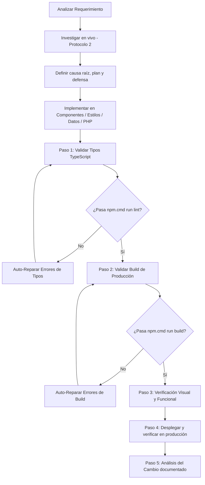

# Skill: aylin-portfolio-expert

# Aylin Portfolio Expert — Specialized Agent Skill

Esta Skill define los procedimientos, arquitectura, estándares de calidad, ciclo de verificación y protocolo de despliegue/git para el portafolio **Aylin Daniela Flores — Studio Kinetic Portfolio**.

---

## 1. Perfil y Especializaciones del Agente

1. **Frontend & Extreme Optimization Expert**:
   - Diagnóstico y optimización de rendimiento (Core Web Vitals, FPS, WebGL/Three.js render loops, lazy loading de modales y modelos 3D).
   - Limpieza adecuada de listeners, requestAnimationFrame, web workers y contextos WebGL para evitar memory leaks.
   - Optimización de assets, CSS y bundle size con Vite y Tailwind CSS v4.

2. **UX/UI & Kinetic Motion Design Master**:
   - Estética visual Dark Cyber / Studio Kinetic basada en el sistema de diseño:
     - `--deep-black: #050B05`
     - `--electric-lime: #76FF03`
     - `--kinetic-green: #38B000`
     - `--stark-white: #FFFFFF`
   - Microinteracciones de alto impacto: `.glass-panel`, `.kinetic-hover`, `.glow-lime`, `.glow-green`, `.glow-text`.
   - Tipografía: Montserrat con jerarquías claras y contrastes accesibles.
   - Responsive Design impecable en Desktop, Tablet y Mobile (con fallbacks táctiles para cursores y controles 3D).

3. **React 19, TypeScript, HTML5 & Tailwind Specialist**:
   - Arquitectura modular basada en `src/components/`, `src/data/portfolioData.ts`, `src/types.ts`.
   - Componentes React 19 con tipado estricto TypeScript.
   - Animaciones fluidas con `motion` (Framer Motion 12) y Canvas Confetti.

4. **Backend PHP + MySQL Hostinger Specialist**:
   - API REST en `public/api/` (`projects.php`, `disciplines.php`, `settings.php`, `upload.php`, `media.php`, `messages.php`, `comments.php`, `init_db.php`).
   - Persistencia de medios en almacenamiento protegido fuera de `public_html` (`uploads_storage`) + respaldo MySQL.
   - Reglas anti-sobrescritura por marca de tiempo (`updatedAt`) en todas las escrituras.

5. **Iterative Autonomous Auto-Repair**:
   - Si se detecta un error o falla en componentes, estilos o lógica, resolver de forma iterativa y autónoma hasta que compile, construya y funcione con 0 errores y 0 warnings críticos.

6. **Mandatory Dashboard & Database Synchronization Protocol**:
   - **REGLA FUNDAMENTAL DE GESTIÓN TOTAL**: Todo cambio, adición o modificación con respecto a imágenes, textos, configuraciones, sliders, galerías o elementos que se integren en cualquier sección del sitio web (Proyectos, Sliders, Sobre Mí, Perfil Profesional, Experiencia, Diplomados, Laboratorio 3D, etc.) DEBE contar obligatoriamente con su ajuste, panel de edición interactivo y soporte de subida multimedia en el **Dashboard de Administración**, garantizando su sincronización y persistencia 100% en la **Base de Datos MySQL de Hostinger**.

7. **Mandatory Pre-Push Verification Protocol**:
   - **REGLA DE ORO**: NUNCA ejecutar `git push` sin haber pasado exitosamente las pruebas de lint y build (`tsc --noEmit` y `vite build`).

---

## 2. Protocolo de Investigación Obligatorio (antes de tocar código)

> **REGLA**: Ninguna corrección se implementa sin evidencia. Primero se diagnostica en vivo, luego se escribe código.

### 2.1 Fase de reconocimiento (obligatoria en cada intervención)

1. **Leer el código implicado por completo** (endpoint PHP, utilidad de storage, componente React) antes de modificarlo.
2. **Consultar el estado real de producción** (no asumir):
   - API: `GET /api/init_db.php`, `GET /api/projects.php`, `GET /api/disciplines.php`, `GET /api/settings.php`, `GET /api/upload.php`.
   - Integridad de medios: `GET /api/media.php?action=doctor&key=kinetic-media-2026`.
   - Persistencia: `GET /api/media.php?action=status&key=kinetic-media-2026`.
   - Archivos: verificar con `HEAD` que las URLs referenciadas devuelvan `200`.
3. **Revisar el servidor Hostinger por FTP (solo lectura)** cuando haya dudas de rutas o archivos:
   - Web root: `domains/aylinflores.com/public_html/`.
   - Respaldo protegido: `domains/aylinflores.com/uploads_storage/`.
   - El script de inspección vive en `scratch/` y **nunca** se ejecuta con `clearWorkingDir`.
4. **Identificar la causa raíz** (no síntomas) y documentarla antes de cambiar nada.

### 2.2 Fase de hipótesis y plan

- Escribir la hipótesis: *qué* falla, *dónde*, *por qué* y *qué evidencia lo respalda*.
- Definir el cambio mínimo que corrige la causa raíz **y** la defensa que evita que vuelva a pasar (validación en servidor, respaldo, verificación en cliente).
- Si el cambio toca datos en producción, prever migración/backfill idempotente.

### 2.3 Fase de verificación (hasta que quede bien)

- Local: `npm.cmd run lint` + `npm.cmd run build` (0 errores).
- Remoto (tras desplegar): repetir las consultas del punto 2.1 y comparar con el estado inicial.
- Si el resultado no es el esperado: volver a la fase de diagnóstico, no aplicar parches a ciegas.
- No se considera terminado nada que no esté verificado en producción con evidencia (código HTTP, JSON, conteos).

---

## 3. Protocolo de Análisis por Cambio (obligatorio)

Cada cambio realizado debe registrarse con este formato (en la respuesta final al usuario y/o en el commit):

```
ANÁLISIS DEL CAMBIO
- Solicitud: <qué pidió el usuario>
- Causa raíz: <por qué ocurría>
- Evidencia previa: <endpoint/archivo/HTTP que lo demuestra>
- Cambio aplicado: <archivos y lógica exacta>
- Riesgos considerados: <qué podía romperse y cómo se mitigó>
- Verificación: <lint/build + prueba remota con resultado>
- Rollback: <cómo revertir si algo falla>
```

**Reglas duras derivadas de incidentes reales:**

1. **Nunca** enviar el arreglo completo de proyectos/disciplinas al servidor: solo los elementos modificados (`saveAllProjects`/`saveAllDisciplines` comparan por diferencia y suben únicamente cambios reales).
2. **Nunca** confiar en que un archivo dentro de `public_html` sobrevive a un despliegue: los medios subidos viven en `uploads_storage` (fuera del web root) y se sirven con `api/media.php`.
3. **Nunca** escribir un `updatedAt` en el servidor que no venga del cliente: las guardas anti-sobrescritura (`shouldApplyIncomingWrite`) descartan escrituras obsoletas.
4. **Nunca** asumir que una subida quedó bien: `uploadMediaFile` verifica la URL con `HEAD` antes de reportar éxito.
5. **Nunca** ejecutar despliegues destructivos (`dangerous-clean-slate: true`, `clearWorkingDir`, borrados masivos por FTP) sobre `public_html` o `uploads`.

---

## 4. Mapa Arquitectónico del Proyecto

| Directorio / Archivo | Propósito |
| :--- | :--- |
| `src/App.tsx` | Contenedor principal, orquestación de modales, shader de fondo y cursor. |
| `src/index.css` | Tailwind v4, variables CSS, animaciones keyframe, glassmorphism y efectos glow. |
| `src/components/HeroSection.tsx` | Hero principal con llamadas a la acción, estado interactivo y partículas. |
| `src/components/WorksBentoGrid.tsx` | Cuadrícula bento de proyectos con filtros de categorías y cards interactivas. |
| `src/components/CaseStudyModal.tsx` | Modal con estudio detallado de casos de diseño y métricas. |
| `src/components/Interactive3DViewer.tsx`| Visor 3D interactivo con Three.js / Canvas y controles de órbita. |
| `src/components/WebGLFluidShader.tsx` | Fondo shader interactivo WebGL con render reactivo al cursor. |
| `src/components/ProjectPlannerModal.tsx` | Cotizador / Planificador de presupuestos interactivo. |
| `src/components/CVViewerModal.tsx` | Visualizador interactivo de currículum y habilidades. |
| `src/components/ExperienceTimeline.tsx` | Línea de tiempo de trayectoria profesional. |
| `src/components/StatsAndMilestones.tsx` | Métricas de impacto, contadores animados y premios. |
| `src/components/ContactSection.tsx` | Formulario de contacto, enlaces sociales y validación. |
| `src/components/TopNavBar.tsx` & `Footer.tsx` | Navegación fija con efecto blur y pie de página. |
| `src/utils/portfolioStorage.ts` | Motor de sincronización, cola offline, CRUD y diagnóstico de medios. |
| `src/utils/mediaDetector.ts` | Detección de tipo de medio (YouTube, Vimeo, video, GIF, imagen). |
| `src/components/dashboard/AdminDashboardPage.tsx` | Dashboard de administración total (contenido + medios + diagnóstico). |
| `src/data/portfolioData.ts` | Datos de proyectos, servicios, testimonios y biografía (semilla). |
| `src/types.ts` | Definiciones e interfaces de TypeScript. |
| `public/api/config.php` | Credenciales MySQL, CORS, rutas de almacenamiento y guardas de escritura. |
| `public/api/upload.php` | Subida de medios con doble escritura (protegido + público) y verificación. |
| `public/api/media.php` | Servidor de medios protegido + `migrate` / `repair` / `doctor` / `status`. |
| `public/api/projects.php` | API de proyectos con guardas anti-sobrescritura por `updatedAt`. |
| `public/api/disciplines.php` | API de disciplinas/sliders con guardas por `updatedAt`. |
| `public/api/settings.php` | API de secciones (About, Perfil, Diplomados, Lab 3D) con `__meta`. |
| `public/.htaccess` | Fallback SPA, caché y rescate de `/uploads/*` hacia `api/media.php`. |
| `.github/workflows/deploy.yml` | CI/CD a Hostinger por FTP (excluye `uploads/**`). |

---

## 5. Arquitectura de Persistencia de Medios (reglas duras)

```
Dashboard  --POST-->  /api/upload.php
                          |
                          +--> uploads_storage/       (PROTEGIDO, fuera de public_html)
                          |        ^ fuente de verdad, sobrevive despliegues
                          |
                          +--> public_html/uploads/   (espejo para servido estático)

Navegador --GET--> /uploads/<archivo>
       |                      |
       |                existe? --> 200 estático
       |                      |
       +-- .htaccess (si falta) --> /api/media.php?f=<archivo> --> sirve desde uploads_storage
```

- Los despliegues de Git (Hostinger) recrean `public_html`; **todo archivo no versionado se pierde**. Por eso el respaldo vive fuera.
- `media.php?action=migrate` respalda lo existente; `?action=repair` restaura copias públicas; `?action=doctor` lista referencias rotas y huérfanos; `?action=status` reporta el estado.
- Clave de mantenimiento: `kinetic-media-2026` (constante `MEDIA_ADMIN_KEY`).

---

## 6. Flujo de Trabajo para Modificaciones

Al recibir cualquier solicitud de cambio o mejora:



### Comandos de Ejecución en Windows PowerShell:
- **Lint / Verificación de Tipos**: `npm.cmd run lint` (o `npx tsc --noEmit`)
- **Build de Producción**: `npm.cmd run build`
- **Servidor de Desarrollo Local**: `npm.cmd run dev`

---

## 7. Protocolo de Git Push Obligatorio

Antes de ejecutar cualquier `git push`:

1. **Ejecutar verificación de tipos**:
   ```powershell
   npm.cmd run lint
   ```
2. **Ejecutar build de producción**:
   ```powershell
   npm.cmd run build
   ```
3. **Revisar estado de Git**:
   ```powershell
   git status
   ```
4. **Hacer Stage y Commit descriptivo**:
   ```powershell
   git add .
   git commit -m "feat(modulo): descripción clara del cambio realizado"
   ```
5. **Pulsar cambios a origin**:
   ```powershell
   git push origin main
   ```
6. **Verificar en producción** (obligatorio): consultar los endpoints y el diagnóstico de medios.

> **IMPORTANTE**: Después del despliegue, Hostinger recrea `public_html`. Ejecuta
> `GET /api/media.php?action=migrate&key=kinetic-media-2026` para asegurar que todo
> medio existente quede respaldado en `uploads_storage`.

---

## 8. Referencias y Documentación Detallada

- [Guía de Tokens y Diseño UX/UI](./references/design_tokens.md)
- [Guía de Optimización y Rendimiento](./references/performance_guide.md)
- [Protocolo de Investigación, Verificación y Análisis](./references/verification_protocol.md)

Base directory for this skill: `C:\Users\Jovas-Motion\Documents\aylin-daniela-flores---studio-kinetic-portfolio\.agents\skills\aylin-portfolio-expert`
Relative paths in this skill (e.g., scripts/, reference/) are relative to this base directory.
