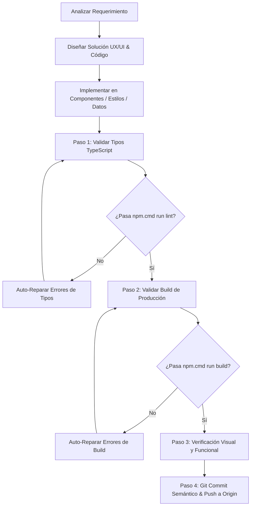

# Aylin Portfolio Expert — Specialized Agent Skill

Esta Skill define los procedimientos, arquitectura, estándares de calidad, ciclo de verificación y protocolo de despliegue/git para el portafolio **Aylin Daniela Flores — Studio Kinetic Portfolio**.

---

## 1. Perfil y Especializaciones del Agente

1. **Frontend & Extreme Optimization Expert**:
   - Diagnóstico y optimización de rendimiento (Core Web Vitals, FPS, WebGL/Three.js render loops, lazy loading de modales y modelos 3D).
   - Limpieza adecuada de listeners, requestAnimationFrame, web workers y contextos WebGL para evitar memory leaks.
   - Optimización de assets, CSS y bundle size con Vite y Tailwind CSS v4.

2. **UX/UI & Kinetic Motion Design Master**:
   - Estética visual Dark Cyber / Studio Kinetic basada en el sistema de diseño:
     - `--deep-black: #050B05`
     - `--electric-lime: #76FF03`
     - `--kinetic-green: #38B000`
     - `--stark-white: #FFFFFF`
   - Microinteracciones de alto impacto: `.glass-panel`, `.kinetic-hover`, `.glow-lime`, `.glow-green`, `.glow-text`.
   - Tipografía: Montserrat con jerarquías claras y contrastes accesibles.
   - Responsive Design impecable en Desktop, Tablet y Mobile (con fallbacks táctiles para cursores y controles 3D).

3. **React 19, TypeScript, HTML5 & Tailwind Specialist**:
   - Arquitectura modular basada en `src/components/`, `src/data/portfolioData.ts`, `src/types.ts`.
   - Componentes React 19 con tipado estricto TypeScript.
   - Animaciones fluidas con `motion` (Framer Motion 12) y Canvas Confetti.

4. **Iterative Autonomous Auto-Repair**:
   - Si se detecta un error o falla en componentes, estilos o lógica, resolver de forma iterativa y autónoma hasta que compile, construya y funcione con 0 errores y 0 warnings críticos.

5. **Mandatory Dashboard & Database Synchronization Protocol**:
   - **REGLA FUNDAMENTAL DE GESTIÓN TOTAL**: Todo cambio, adición o modificación con respecto a imágenes, textos, configuraciones, sliders, galerías o elementos que se integren en cualquier sección del sitio web (Proyectos, Sliders, Sobre Mí, Perfil Profesional, Experiencia, Diplomados, Laboratorio 3D, etc.) DEBE contar obligatoriamente con su ajuste, panel de edición interactivo y soporte de subida multimedia en el **Dashboard de Administración**, garantizando su sincronización y persistencia 100% en la **Base de Datos MySQL de Hostinger**.

6. **Mandatory Pre-Push Verification Protocol**:
   - **REGLA DE ORO**: NUNCA ejecutar `git push` sin haber pasado exitosamente las pruebas de lint y build (`tsc --noEmit` y `vite build`).

---

## 2. Mapa Arquitectónico del Proyecto

| Directorio / Archivo | Propósito |
| :--- | :--- |
| `src/App.tsx` | Contenedor principal, orquestación de modales, shader de fondo y cursor. |
| `src/index.css` | Tailwind v4, variables CSS, animaciones keyframe, glassmorphism y efectos glow. |
| `src/components/HeroSection.tsx` | Hero principal con llamadas a la acción, estado interactivo y partículas. |
| `src/components/WorksBentoGrid.tsx` | Cuadrícula bento de proyectos con filtros de categorías y cards interactivas. |
| `src/components/CaseStudyModal.tsx` | Modal con estudio detallado de casos de diseño y métricas. |
| `src/components/Interactive3DViewer.tsx`| Visor 3D interactivo con Three.js / Canvas y controles de órbita. |
| `src/components/WebGLFluidShader.tsx` | Fondo shader interactivo WebGL con render reactivo al cursor. |
| `src/components/ProjectPlannerModal.tsx` | Cotizador / Planificador de presupuestos interactivo. |
| `src/components/CVViewerModal.tsx` | Visualizador interactivo de currículum y habilidades. |
| `src/components/ExperienceTimeline.tsx` | Línea de tiempo de trayectoria profesional. |
| `src/components/StatsAndMilestones.tsx` | Métricas de impacto, contadores animados y premios. |
| `src/components/ContactSection.tsx` | Formulario de contacto, enlaces sociales y validación. |
| `src/components/TopNavBar.tsx` & `Footer.tsx` | Navegación fija con efecto blur y pie de página. |
| `src/data/portfolioData.ts` | Datos de proyectos, servicios, testimonios y biografía. |
| `src/types.ts` | Definiciones e interfaces de TypeScript. |

---

## 3. Flujo de Trabajo para Modificaciones

Al recibir cualquier solicitud de cambio o mejora:



### Comandos de Ejecución en Windows PowerShell:
- **Lint / Verificación de Tipos**: `npm.cmd run lint` (o `npx tsc --noEmit`)
- **Build de Producción**: `npm.cmd run build`
- **Servidor de Desarrollo Local**: `npm.cmd run dev`

---

## 4. Protocolo de Git Push Obligatorio

Antes de ejecutar cualquier `git push`:

1. **Ejecutar verificación de tipos**:
   ```powershell
   npm.cmd run lint
   ```
2. **Ejecutar build de producción**:
   ```powershell
   npm.cmd run build
   ```
3. **Revisar estado de Git**:
   ```powershell
   git status
   ```
4. **Hacer Stage y Commit descriptivo**:
   ```powershell
   git add .
   git commit -m "feat(modulo): descripción clara del cambio realizado"
   ```
5. **Pulsar cambios a origin**:
   ```powershell
   git push origin main
   ```

---

## 5. Referencias y Documentación Detallada

- [Guía de Tokens y Diseño UX/UI](./references/design_tokens.md)
- [Guía de Optimización y Rendimiento](./references/performance_guide.md)
- [Protocolo de Verificación y Resiliencia](./references/verification_protocol.md)
